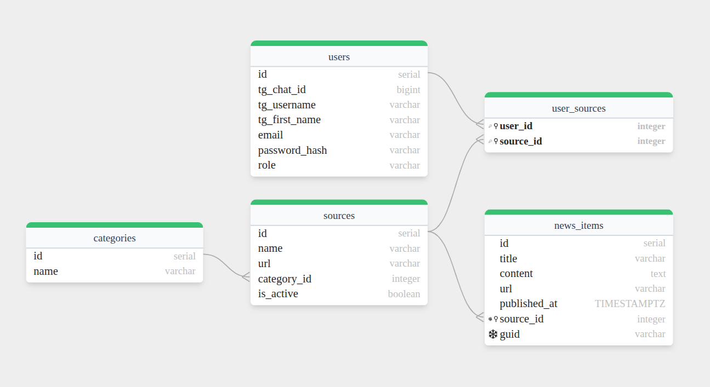

# Агрегатор новостных лент
  

NewsBot — это полнофункциональная платформа для автоматического сбора, хранения и персонализированной доставки новостного контента из различных RSS-источников. Проект включает REST API, фоновый парсер новостей, а также удобного Telegram-бота и веб-интерфейса для управления подписками и просмотра новостей.
## Основные возможности
- Автоматический сбор новостей
  - Поддержка RSS-источников
  - Фоновый парсер с retry-логикой
  - Дедупликация новостей по URL и GUID
  - Автоматическое обновление через определенный временной интервал

### 💻 Веб-интерфейс (React)
- Полноценная аутентификация (регистрация/вход)
- Управление подписками через удобный интерфейс
- Лента новостей с пагинацией
- Админ-панель для управления системой
- JWT-аутентификация с защищенными маршрутами

- Telegram-бот
  - Управление подписками через inline-кнопки
  - Просмотр новостей с пагинацией
  - Ручное обновление новостей
  - Админ-панель для управления системой
  - Rate limiting для предотвращения спама

- Безопасность и аутентификация
  - JWT аутентификация с ролями (user/admin)
  - Защита от перегрузки (rate limiting)
  - Graceful shutdown всех компонентов

## Установка и запуск
### Предварительные требования
- Docker & Docker Compose
- Node.js 18+ и npm (для разработки фронтенда)
- Telegram Bot Token (от @BotFather)
- Go 1.24+ (для разработки)

```bash
# 1. Клонировать репозиторий
git clone https://github.com/SANEKNAYMCHIK/newsBot.git
cd newsBot

# 2. Создать файл конфигурации
cp .env.example .env
# Отредактировать .env, добавив TOKEN для телеграм

# 3. Запустить все сервисы со сборкой (бэкенд + БД)
docker-compose up -d --build

# 4. Запустить фронтенд (в новом терминале)
cd frontend
npm install
npm start
```

## Использование веб-интерфейса
### Основные страницы
- Авторизация
  - Регистрация нового пользователя
  - Вход в систему
  - Восстановление сессии через JWT токен
- Лента новостей
  - Просмотр новостей из подписанных источников
  - Пагинация (20 новостей на страницу)
  - Фильтрация по источникам
  - Поиск по заголовкам и содержимому
  - Отметка новостей как прочитанных
- Управление подписками
  - Просмотр доступных RSS-источников
  - Подписка/отписка на источники
  - Поиск источников по названию или категории
  - Группировка по категориям
- Админ-панель (для администраторов)
  - Просмотр всех пользователей системы
  - Управление пользователями (назначение админов)
  - Управление RSS-источниками
  - Управление категориями
  - Статистика системы
  - Пагинация для больших списков

## Использование Telegram-бота
**Основные команды**
```text
/start - Начать работу с ботом
/help - Показать справку по командам
/subscribe - Управление подписками
/news [страница] - Последние новости (с пагинацией)
/sources [страница] - Доступные источники
/source_news <id> [страница] - Новости конкретного источника
/categories - Все категории
/add_source - Добавить новый источник
/update - Обновить новости вручную
/update_status <id> - Проверить статус обновления
```
**Админские команды**
```text
/admin - Панель администратора
/admin_users [страница] - Список пользователей
/admin_stats - Статистика системы
/admin_make_admin <user_id> - Назначить админа
/admin_remove_admin <user_id> - Снять админа
/admin_add_category <название> - Добавить категорию
/admin_update_source <id> <true/false> - Изменить активность источника
/admin_deactivate_source <id> - Деактивировать источник
/admin_activate_source <id> - Активировать источник
```


### Примеры использования
```bash
# Просмотр новостей с пагинацией
/news      # Первая страница
/news 2    # Вторая страница
/news 3    # Третья страница

# Просмотр новостей конкретного источника
/source_news 1      # Источник с ID=1
/source_news 1 2    # Вторая страница новостей источника 1

# Добавление нового источника
/add_source Habr; https://habr.com/ru/rss/articles/; 1
```
## REST API
### Аутентификация
```bash
# Регистрация
POST /auth/register
{
  "email": "user@example.com",
  "password": "password"
}

# Вход
POST /auth/login
{
  "email": "user@example.com",
  "password": "password"
}
```

### Использование токена
#### Authorization: Bearer <JWT_TOKEN>

### Основные эндпоинты

Метод | Эндпоинт | Описание | Аутентификация
--- | --- | --- | ---
POST | /auth/register | Регистрация | ❌
POST | /auth/login | Вход | ❌
POST | /auth/telegram | Запуск через телеграм | ❌
GET | /user/profile | Данные пользователя | ✅
POST | /user/refresh | Обновить все новости из источников пользователя | ✅
GET | /user/refresh/:id | Проверить статус обновления новостей пользователя | ✅
GET | /user/subscriptions/ | Подписки пользователя | ✅
POST | /user/subscriptions/ | Подписаться на источник | ✅
DELETE | /user/subscriptions/:id | Отписаться от источника | ✅
GET | /news/ | Новости пользователя | ✅
GET | /news/:id | Новость по ее ID | ✅
GET | /news/sources | Получить список активных источников | ✅
GET | /news/all-sources | Получить список всех источников | ✅
POST | /news/sources | Добавить новый источник | ✅
GET | /news/categories | Получить все категории | ✅
GET | /news/source/:id | Получить новости по ID источника | ✅
POST | /admin/users/:id/make-admin | Назначить пользователя с указанным ID админом | ✅
POST | /admin/users/:id/remove-admin | Снять пользователя с указанным ID роль админа | ✅
GET | /admin/users | Список всех пользователй | ✅
PUT | /admin/sources/:id | Изменить активность источника | ✅
DELETE | /admin/sources/:id | Удалить источник | ✅
POST | /admin/categories | Добавить новую категорию | ✅

## Структура базы данных
```sql
-- Основные таблицы:
users           # Пользователи
categories      # Категории новостей
sources         # RSS-источники
news_items      # Новостные статьи
user_sources    # Подписки пользователей
```

### Миграции
Миграции выполняются автоматически при запуске приложения

## Тестирование
```bash
# Unit тесты
go test ./internal/services/... -v
```
## Поддержать проект
Если проект вам понравился, то обязательно поставьте звезду репозиторию!